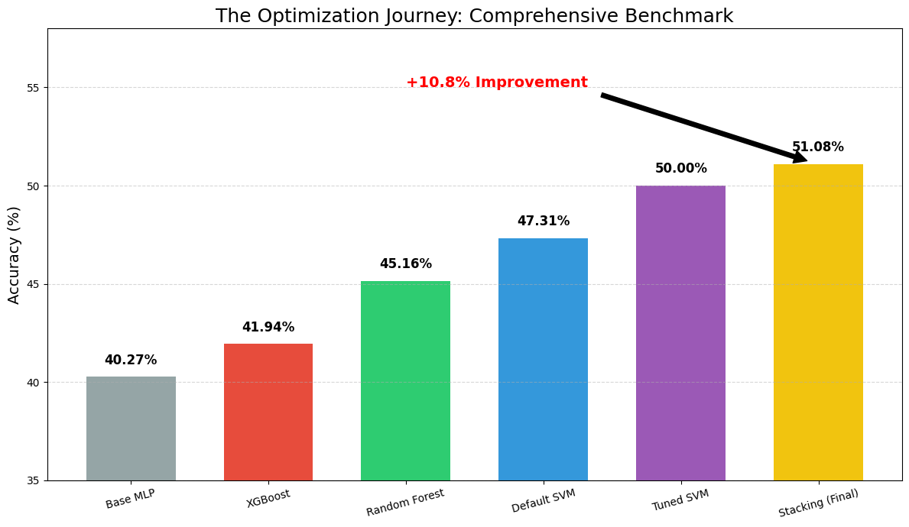

Computational Classification of Persian Musical Modes
=====================================================


Abstract
--------

This project investigates the application of machine learning and deep learning architectures for the classification of Iranian traditional musical modes, known as Dastgahs. Using the MJMusicDataset, which consists of 69 spectral and harmonic audio features, we aimed to build a robust classifier capable of distinguishing between seven primary Dastgahs: Shur, Nava, Mahur, Homayun, Segah, Chahargah, and Rast-Panjgah.

The study involves extensive Exploratory Data Analysis (EDA) to handle high multicollinearity, followed by the implementation of a Multi-Layer Perceptron (MLP) baseline. We further evaluated dimensionality reduction via Stacked Autoencoders and optimized performance using advanced ensemble methods, ultimately achieving state-of-the-art results with a Stacking Classifier.
<p align="center">
  
  <br>
  <i>Figure 1: Comprehensive benchmark comparing the Baseline MLP against Ensemble Methods (Random Forest, SVM, Stacking).</i>
</p>

Project Structure
-----------------

The repository is organized as follows:


```
├── data/
│   └── raw/                 # Raw dataset (MJMusicDataset)
├── notebooks/
│   ├── 01_Main_Analysis_MLP_AE.ipynb      # EDA, Preprocessing, MLP Baseline, and Autoencoders
│   └── 02_Bonus_Ensemble_Methods.ipynb    # Random Forest, XGBoost, SVM, and Stacking Ensemble
├── docs/
│   ├── Project_Description.pdf            # Original project requirements
│   └── Research_Report.pdf                # Detailed scientific report and analysis
├── outputs/
│   ├── figures/             # Confusion matrices and loss plots
│   └── models/              # Saved trained models (.pkl and .h5)
├── requirements.txt         # List of dependencies
└── README.md                # Project documentation

```

Dataset and Features
--------------------

The dataset aggregates audio features extracted from a diverse collection of traditional tracks. It includes:

-   **Spectral Features:** Zero Crossing Rate, Spectral Centroid, and Roll-off (Mean and Variance).

-   **Harmonic Features:** Chroma vectors (12 semitones) capturing harmonic content.

-   **Timbral Features:** Mel-Frequency Cepstral Coefficients (MFCCs 1-20) representing timbral texture.

Methodology
-----------

### 1\. Data Analysis and Preprocessing

-   **Stratified Split:** Data was split into 80% training and 20% testing sets, preserving class distribution.

-   **Multicollinearity Analysis:** Correlation heatmaps revealed high redundancy among MFCC features.

-   **Feature Selection:** Utilized ANOVA (SelectKBest) to identify the top 20 most predictive features, highlighting `chroma_11_var` as the most significant predictor.

### 2\. Neural Network Baseline (MLP)

-   Implemented an MLP Classifier with GridSearch optimization for architecture and regularization.

-   **Result:** The baseline model achieved a reliable cross-validation accuracy of approximately 40.27%.

### 3\. Feature Engineering with Autoencoders

-   Designed a Stacked Autoencoder (70 &#8594; 64 &#8594; 32 &#8594;64 &#8594; 70) for non-linear dimensionality reduction.

-   **Observation:** Compressing features to a 32-dimensional latent space resulted in information loss, reducing accuracy to 37%.

### 4\. Advanced Classification (Ensemble Methods)

To surpass the MLP baseline, we implemented tree-based and kernel-based architectures:

-   **Random Forest:** Utilized Bagging to handle multicollinearity.

-   **XGBoost:** Applied Gradient Boosting for sequential error correction.

-   **Support Vector Machine (SVM):** Used an RBF kernel to manage non-linear decision boundaries.

### 5\. Stacking Ensemble (The Champion Model)

We constructed a Stacking Classifier using Random Forest and Tuned SVM as Level-0 learners, and Logistic Regression as the Level-1 meta-learner.

Results
-------

The comprehensive benchmark demonstrates that Ensemble Methods significantly outperform the Neural Network baseline for this dataset.

| **Rank** | **Model Architecture** | **Accuracy** | **Status** |
| --- | --- | --- | --- |
| 1 | **Stacking (RF + Tuned SVM)** | **51.08%** | **State-of-the-Art** |
| 2 | Tuned SVM (RBF) | 50.00% | Excellent |
| 3 | Random Forest | 45.16% | Strong |
| 4 | XGBoost | 41.94% | Competitive |
| 5 | Base MLP | 40.27% | Baseline |


Real-World Inference
--------------------

The optimized model was deployed to infer the Dastgah of an unseen track ("Be Sokoot-e Sard-e Zaman" by Master Shajarian).

-   **Prediction:** Mahur (D<sub>2</sub>)

-   **Confidence:** 95.67% 

Getting Started
---------------

To reproduce the results, clone the repository and install the dependencies:


```
git clone https://github.com/Aidin-Sahneh/Computational-Persian-Music-Classification.git
cd Computational-Persian-Music-Classification
pip install -r requirements.txt

```

The notebooks can be run locally or uploaded to Google Colab.

Author
------

**Aidin Sahneh**

-   Student ID: 40120243

-   Department of Electrical and Computer Engineering

-   K. N. Toosi University of Technology
